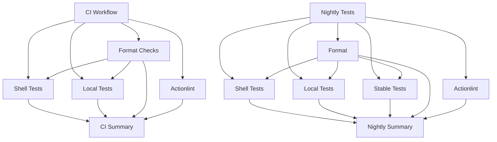

# GitHub Actions Workflows Documentation

This document describes all GitHub Actions workflows in this repository.

## Overview

The workflows are organized into several categories:

- **CI/CD**: Continuous integration and testing
- **Security**: Code security scanning and dependency review
- **Quality**: Code formatting, linting, and validation
- **Maintenance**: Automated maintenance tasks

## Workflows

### CI Workflows

#### `ci.yaml` - Continuous Integration

**Triggers**: Push to main, Pull requests to main, Manual dispatch

**Purpose**: Main CI pipeline that runs on every PR and push to main.

**Jobs**:

- `format`: Runs formatting checks (markdown, shell, YAML)
- `actionlint`: Validates GitHub Actions workflow syntax
- `test-shell`: Runs BATS unit tests on multiple platforms
- `test-local`: Tests the local action on multiple platforms
- `ci-summary`: Generates a summary of all CI job results

**Features**:

- Concurrency control to prevent duplicate runs
- Job dependencies for optimal parallelization
- Comprehensive summary report

#### `nightly-tests.yaml` - Nightly Test Suite

**Triggers**: Daily at 9:00 AM UTC, Manual dispatch

**Purpose**: Extended test suite that includes stable action testing across
multiple platforms.

**Jobs**:

- `format`: Formatting checks
- `actionlint`: Workflow validation
- `test-shell`: BATS unit tests
- `test-local`: Local action tests
- `test-stable`: Tests the published stable action (v1.7)
- `nightly-summary`: Summary of all nightly test results

**Features**:

- Tests both local and published versions of the action
- Runs on a comprehensive matrix of OS platforms
- Non-canceling concurrency (scheduled runs complete fully)

### Test Workflows

#### `test-shell.yaml` - Shell Unit Tests

**Triggers**: Workflow call, Manual dispatch

**Purpose**: Runs BATS (Bash Automated Testing System) unit tests.

**Test Matrix**:

- Ubuntu (latest, 24.04, 22.04, ARM variants)
- macOS (latest, 26, 15, 14, 15-intel)

**Features**:

- Caching for apt and Homebrew packages
- Cross-platform testing (Linux and macOS)
- Job summaries for each platform

#### `test-local.yaml` - Local Action Tests

**Triggers**: Workflow call, Manual dispatch

**Purpose**: Tests the action directly from the repository checkout.

**Test Matrix**: Same as `test-shell.yaml`

**Features**:

- Tests with default max_age_hours (24h)
- Tests with custom max_age_hours (48h)
- Cross-platform compatibility verification

#### `test-stable.yaml` - Stable Action Tests

**Triggers**: Workflow call, Manual dispatch

**Purpose**: Tests the published stable version of the action (v1.7).

**Test Matrix**: Same as `test-shell.yaml`

**Features**:

- Validates published action functionality
- Tests with default and custom configurations
- Ensures backward compatibility

### Quality Workflows

#### `format.yaml` - Code Formatting

**Triggers**: Workflow call, Manual dispatch

**Purpose**: Checks code formatting and style across all file types.

**Jobs**:

- `markdown`: Lints Markdown files with markdownlint-cli
- `shell`: Checks shell scripts with ShellCheck and shfmt
- `yaml`: Validates YAML files with yamllint

**Features**:

- Caching for npm and apt packages
- Comprehensive formatting checks
- Job summaries for each check type

#### `actionlint.yaml` - GitHub Actions Validation

**Triggers**: Push/PR to main (when workflows change), Manual dispatch

**Purpose**: Validates GitHub Actions workflow syntax and best practices.

**Features**:

- Automatic actionlint installation
- SARIF output for security scanning integration
- Color-coded output for better readability
- Runs only when workflow files change

### Security Workflows

#### `codeql.yaml` - CodeQL Security Analysis

**Triggers**: Push to main, Pull requests to main, Weekly (Mondays at 12PM
UTC)

**Purpose**: Performs security analysis using GitHub's CodeQL engine.

**Features**:

- JavaScript/TypeScript analysis (for workflow and script validation)
- Security and quality queries
- Scheduled weekly scans
- SARIF output for security alerts

#### `dependency-review.yml` - Dependency Security Review

**Triggers**: Pull requests to main

**Purpose**: Reviews dependency changes in PRs for known vulnerabilities.

**Features**:

- Automatic vulnerability detection
- PR comments with security findings
- Blocks PRs with critical vulnerabilities (optional)
- Supply chain security

### Maintenance Workflows

#### `cancel_stale_queued_runs.yaml` - Queue Cleanup

**Triggers**: Hourly schedule, Manual dispatch

**Purpose**: Automatically cancels workflow runs that have been queued for more
than 24 hours.

**Features**:

- Runs every hour
- Uses the action itself (dogfooding)
- Prevents queue buildup

#### `weekly-doc-check.yaml` - Documentation Review

**Triggers**: Weekly (Fridays at 9AM UTC), Manual dispatch

**Purpose**: Automated documentation review and link checking.

**Features**:

- Markdown linting
- Broken link detection
- Creates GitHub issues for review
- Copilot integration for automated updates

#### `outdated-actions.yaml` - Actions Version Check

**Triggers**: Weekly (Mondays at 10AM UTC), Manual dispatch

**Purpose**: Checks for outdated GitHub Actions and creates review issues.

**Features**:

- Scans all workflow files
- Lists current action versions
- Creates issues for review
- Helps maintain up-to-date dependencies

## Best Practices Implemented

### Concurrency Control

All workflows use concurrency controls to prevent duplicate runs:

```yaml
concurrency:
  group: ${{ github.workflow }}-${{ github.ref }}
  cancel-in-progress: true # or false for scheduled jobs
```

### Caching Strategy

Workflows cache dependencies to improve performance:

- **npm packages**: `~/.npm`
- **apt packages**: `/var/cache/apt/archives`
- **Homebrew packages**: `~/Library/Caches/Homebrew`

### Job Summaries

All workflows generate job summaries using `$GITHUB_STEP_SUMMARY`:

- Provides quick overview of results
- Easy to see pass/fail status
- Links to relevant logs and artifacts

### Permissions

Workflows use minimal required permissions:

```yaml
permissions:
  contents: read # For checkout
  actions: write # For canceling runs (when needed)
  security-events: write # For CodeQL (when needed)
```

### Timeout Management

All jobs have appropriate timeout settings:

- Standard jobs: 10 minutes
- Security scans: 15 minutes
- Documentation checks: 30 minutes

### Matrix Strategy

Tests run on comprehensive platform matrices:

- Multiple Ubuntu versions (including ARM)
- Multiple macOS versions (including Intel and ARM)
- `fail-fast: false` to see all platform results

## Workflow Dependencies



## Maintenance

### Adding a New Workflow

1. Create the workflow file in `.github/workflows/`
2. Add concurrency control
3. Set minimal permissions
4. Add appropriate timeouts
5. Include job summaries
6. Add caching where applicable
7. Run `yamllint` to validate syntax
8. Test with `actionlint`

### Updating Action Versions

1. Check Dependabot PRs for action updates
2. Review `outdated-actions.yaml` weekly issues
3. Update version references in workflow files
4. Test changes in a PR
5. Monitor for any breaking changes

### Troubleshooting

- **Workflow fails to trigger**: Check branch filters and path filters
- **Concurrency issues**: Review concurrency group configuration
- **Permission errors**: Verify workflow has required permissions
- **Cache misses**: Check cache key generation and restore-keys
- **Timeout**: Adjust timeout-minutes or optimize job steps

## Security Considerations

1. **Minimal Permissions**: All workflows use least-privilege permissions
2. **Dependency Scanning**: Automated with Dependabot and dependency-review
3. **Code Scanning**: CodeQL runs on schedule and for all PRs
4. **Secret Management**: No secrets stored in workflow files
5. **Action Pinning**: Using semantic versioning for action references

## Performance Optimization

1. **Parallel Jobs**: Independent jobs run in parallel
2. **Caching**: Aggressive caching of dependencies
3. **Concurrency**: Prevents duplicate runs
4. **Targeted Triggers**: Workflows only run when relevant files change
5. **Matrix Optimization**: `max-parallel: 8` for faster feedback

## Contributing

When modifying workflows:

1. Run `make format` to validate YAML
2. Test changes in a PR
3. Check actionlint output
4. Update this documentation
5. Consider impact on CI/CD pipeline

## References

- [GitHub Actions Documentation](https://docs.github.com/actions)
- [Workflow Syntax](https://docs.github.com/actions/using-workflows/workflow-syntax-for-github-actions)
- [Security Hardening](https://docs.github.com/actions/security-guides/security-hardening-for-github-actions)
- [Caching Dependencies](https://docs.github.com/actions/using-workflows/caching-dependencies-to-speed-up-workflows)
